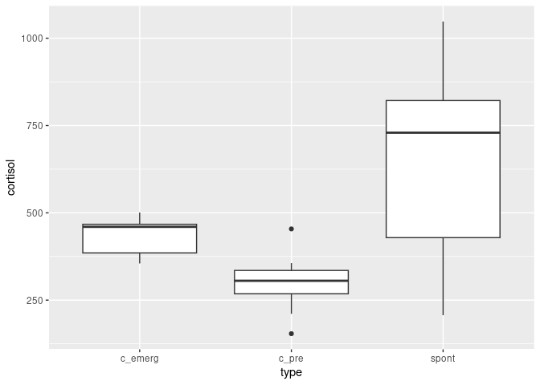

# Thing 2


## Installation

You can install the development version of thing2 from
[GitHub](https://github.com/) with:

``` r
# install.packages("devtools")
devtools::install_github("nxskok/thing2")
```

## The data

The data on which this mini-analysis was based came from here:

``` r
library(Devore7)
```

    Loading required package: MASS

    Loading required package: lattice

``` r
data(ex15.25)
ex15.25
```

       Group.1 Group.2 Group.3
    1      262     465     343
    2      307     501     772
    3      211     455     207
    4      323     355    1048
    5      454     468     838
    6      339     362     687
    7      304      NA      NA
    8      154      NA      NA
    9      287      NA      NA
    10     356      NA      NA

In Devore’s textbook it says, about these data:

The accompanying data on cortisol level was reported in the article
“Cortisol, Cortisone, and 11-Deoxycortisol Levels in Human Umbilical and
Maternal Plasma in Relation to the Onset of Labor” (J. Obstetric
Gynaecology British Com- monwealth, 1974: 737–745). Experimental
subjects were pregnant women whose babies were delivered between 38 and
42 weeks gestation. Group 1 individuals elected to deliver by Caesarean
section before labor onset, group 2 delivered by emergency Caesarean
during induced labor, and group 3 individuals experienced spontaneous
labor.

This indicates that each pregnant woman contributed one birth to the
dataset, and we have independent observations. This is not the
impression conveyed by this display of the dataset, which was evidently
laid out this way to display in the textbook rather than being ready for
analysis.

The purpose of this package is to illustrate the use of writing a
package for a simple analysis.

The function `read_raw` reorganizes these data to be suitable for some
kind of analysis of variance. In particular:

- the dataframe is pivoted longer
- the missing values are removed (these are “structural” missing values,
  not actual missing data)
- the group numbers are replaced by names that indicate which group is
  which:

``` r
library(thing2)
births <- read_raw()
births
```

    # A tibble: 22 × 2
       cortisol type   
          <dbl> <chr>  
     1      262 c_pre  
     2      465 c_emerg
     3      343 spont  
     4      307 c_pre  
     5      501 c_emerg
     6      772 spont  
     7      211 c_pre  
     8      455 c_emerg
     9      207 spont  
    10      323 c_pre  
    # ℹ 12 more rows

The levels of `type` indicate whether the labour was spontaneous
(`spont`), whether a Caesarean section was planned before labour started
(`c_pre`), or whether an emergency Caesarian section was used to deliver
the baby during induced labour (`c_emerg`). Interest in this study was
in whether the mother’s average cortisol level differed between the
three types of birth.

The function `draw_boxplot`, as the name suggests, draws a boxplot to
compare the distributions of cortisol levels between the three groups of
mothers:

``` r
draw_boxplot(births)
```



The median cortisol levels clearly differ among the three groups. In
addition, the shapes of the distributions differ substantially, with the
spontaneous-labour births having much the greatest variability. There
are also outliers in the `c_pre` group, though one might argue that
these appear as outliers because of the small variability in the other
observations.

The graph reveals that we should not consider these two analyses:

- a standard ANOVA because the groups differ substantially in spread
- despite the outliers, a Kruskal-Wallis test is not appropriate because
  the distributions differ in shape (the assumption is sometimes
  expressed as “the distributions differ only in centre”).

The best parametric analysis is a Welch ANOVA (done by `oneway.test`),
and the appropriate followup is the Games-Howell test (done by
`gamesHowellTest` in package `PMCMRplus`), as done by function
`run_welch`:

``` r
run_welch(births)
```

    [[1]]

        One-way analysis of means (not assuming equal variances)

    data:  cortisol and type
    F = 8.7808, num df = 2.000, denom df = 9.815, p-value = 0.006513


    [[2]]


        Pairwise comparisons using Games-Howell test

    data: cortisol by factor(type)

          c_emerg c_pre 
    c_pre 0.0061  -     
    spont 0.3109  0.0913


    P value adjustment method: none

    alternative hypothesis: two.sided

The first output is the overall Welch test, which is significant, so the
mean cortisol levels are not all equal. The second one shows which
groups differ significantly: just the two Caesarean groups. You might
find this surprising, because the median of `spont` is much the largest,
but the `spont` values are much more spread out, so that it is not
possible to prove that the mean of this group is different from the
means of either of the other two groups. The two Caesarean groups *are*
significantly different in mean cortisol, however, because these groups
have much smaller spread than the `spont` group.

If the outliers are a concern to you, the appropriate non-parametric
test is Mood’s median test, which makes no assumptions about variances.
I wrote a package `smmr` (not on CRAN) to run this test:

``` r
# install_github("nxskok/smmr")
library(smmr)
median_test(births, cortisol, type)
```

    $grand_median
    [1] 355.5

    $table
             above
    group     above below
      c_emerg     5     1
      c_pre       2     8
      spont       4     2

    $test
           what      value
    1 statistic 6.93333333
    2        df 2.00000000
    3   P-value 0.03122093

This has a similar significance to the Welch test (with a larger
P-value), and indeed a possible followup (all possible Mood’s median
tests with a Bonferroni correction) has a similar result to the
Games-Howell test:

``` r
pairwise_median_test(births, cortisol, type)
```

    # A tibble: 3 × 4
      g1      g2    p_value adj_p_value
      <chr>   <chr>   <dbl>       <dbl>
    1 c_emerg c_pre 0.00195     0.00584
    2 c_emerg spont 0.248       0.745  
    3 c_pre   spont 0.0389      0.117  

that is to say, only the two Caesarian groups differ significantly in
(now) median.
